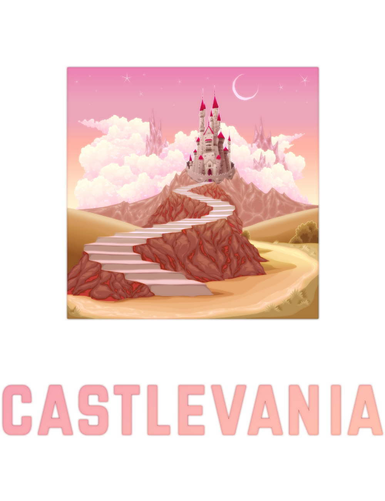

</br>
<div align="center">
  
  <h1 style="font-size: 40px; font-weight: bold; text-align: center">
      🌙 CASTLEVANIA
  </h1>
</div>
</br></br>

###  Installing Go & MySQL throught **Chocolatey** [Windows 10/11]
```batch
choco install golang -Y
choco install mysql -Y
```
###  Uninstalling:
```batch
choco uninstall golang
choco uninstall mysql
```

</br>

### Installing Go & MySQL throught **APT** (Ubuntu 20.04):
- #### Ensure system is up to date
```sh
sudo apt update && apt upgrade -y
```
- #### Download & extract go from their official website (1.18.3)
```sh
curl -LO https://go.dev/dl/go1.18.3.linux-amd64.tar.gz
sudo tar -C /usr/local -xzf go1.18beta1.linux-amd64.tar.gz
```
- #### Configure environment variables
```sh
export GOROOT=/usr/local/go
export GOPATH=$HOME/go
export PATH=$GOPATH/bin:$GOROOT/bin:$PATH
```
- #### Apply changes to the system
```sh
source ~/.bashrc
```
- #### Install MySQL & start setup
```sh
sudo apt install mysql-server 
sudo mysql_secure_installation
```

</br>

### Throught their official websites:

- #### MySQL Community Server: *https://dev.mysql.com/downloads/mysql/*
- ####  GoLang Installers: *https://go.dev/dl/*

</br>

### **Creating castlevania db**
- #### Log into MySQL shell and execute the following query:
```sql
CREATE DATABASE castlevania;
```
